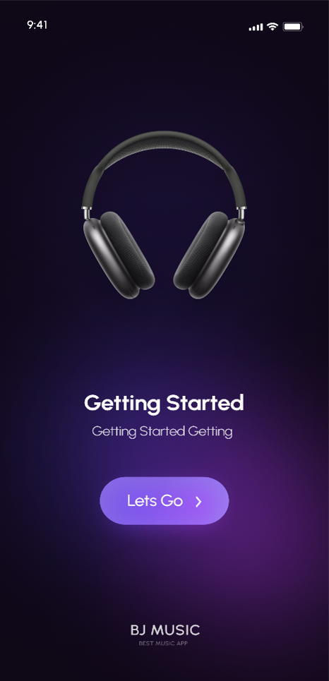
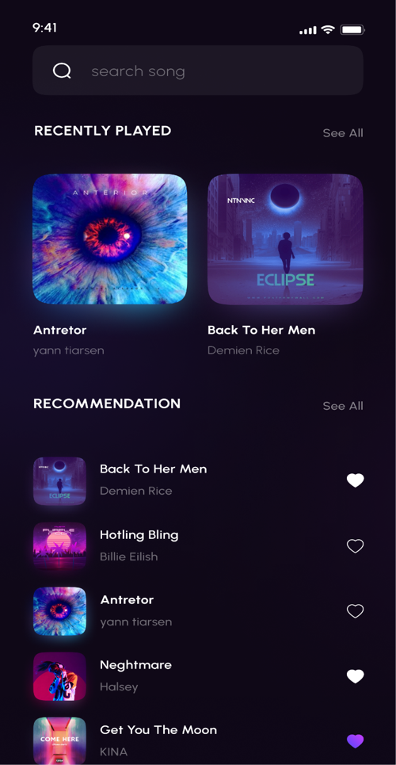
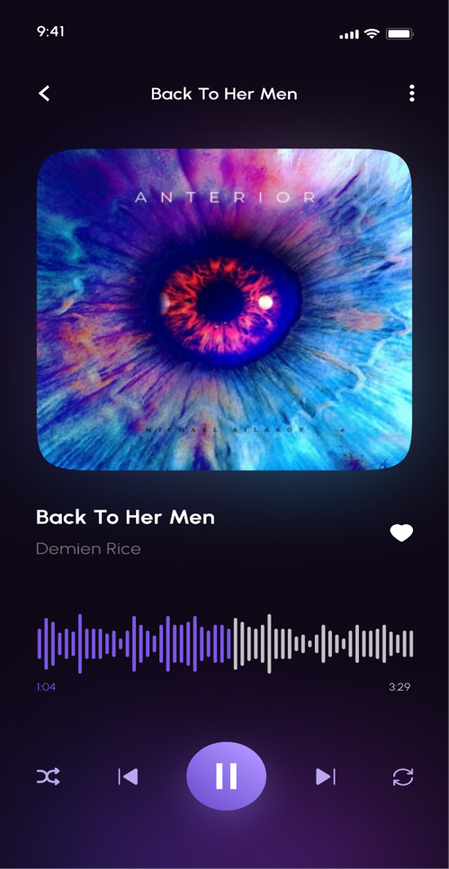

# 🎵 Local Music Player – Android App

A lightweight and user-friendly **music player** app for Android, developed in **Java** using **Android Studio**.  
Designed to play local audio files stored on the device, with a clean interface and essential playback controls.

---

## 🎶 Features

- Play local music files offline
- Simple and intuitive user interface
- Basic playback controls: play, pause, next, previous
- Supports common audio formats
- Built with native Android components for smooth performance

---

## 🛠 Tech Stack

- Java (Core logic)
- Android Studio
- XML (UI Design)

---

## 📸 Screenshots

  
  
  

> Screenshots demonstrate app functionality – source code is private.

---

## 🚧 Status

The app is fully functional with basic features implemented. Future updates may include support for playlists, shuffle, and equalizer.
